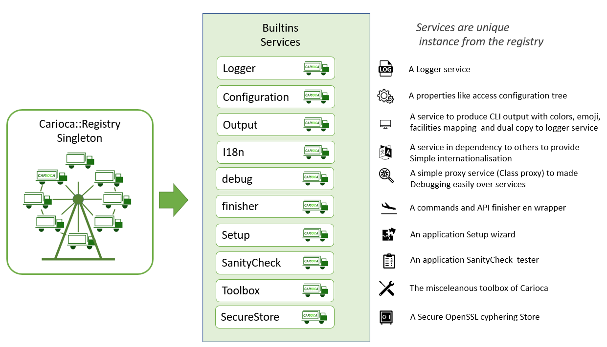
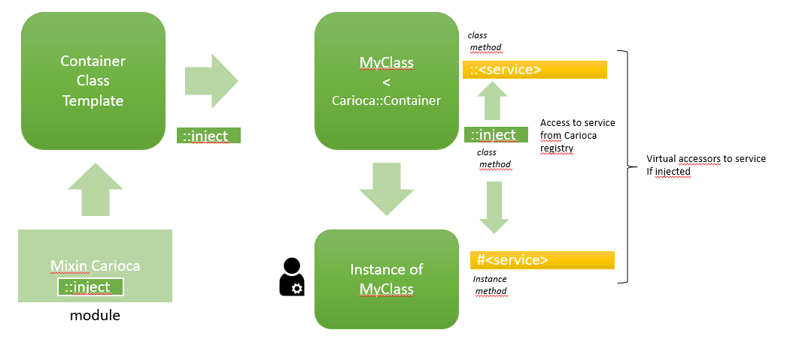
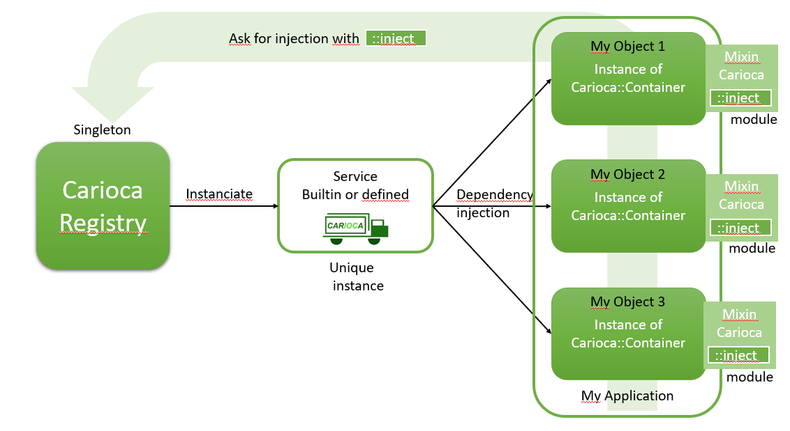
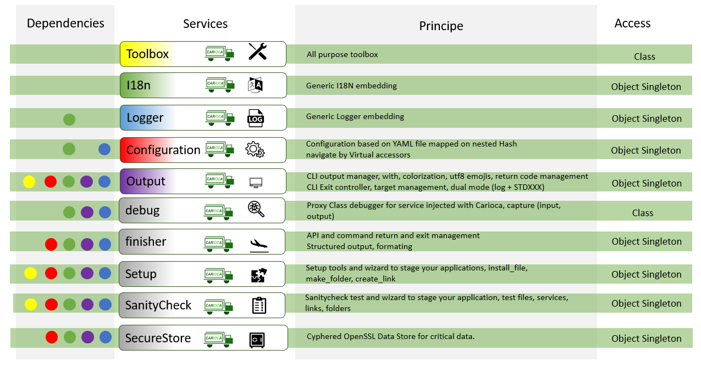

# Carioca

Carioca : Container And Registry with Inversion Of Control for your Applications

Carioca 2: is a complete rewrite who provide a full IoC/DI light Container and a services registry, build with logs, config and Internationalization facilities for designing your applications


[](https://rubydoc.info/gems/carioca)


[](https://badge.fury.io/rb/carioca)


<noscript><a href="https://liberapay.com/ruydiaz/donate"></a></noscript>


 
_Container And Registry with Inversion Of Control for your Applications_


## Installation

Install it yourself as:

    $ gem install carioca

## Principe 



## Usage


### Basic usage


#### Principe


### usecase
Create you own gem :

    $ bundle gem yourgem
    $ cd yourgem
    $ vi yourgem.gemspec

check all the TODO in your gemspec, specify concretly you Gem specification, add the following line :

```ruby
     spec.add_dependency "carioca", "~> 2.0"
```
and after :

    $ bundle add carioca
    $ mkdir -p config/locales

Edit the Rakefil, and add the following line :

```ruby
require "carioca/rake/manage"
```
Verify, all is right with :

    $ rake -T
    rake build                         # Build sample-0.1.0.gem into the pkg directory
    rake carioca:gem:init_path         # prepare Gem vitals path for Carioca
    rake carioca:registry:add_service  # Adding service to Carioca Registry file
    rake carioca:services:config:init  # Initialise Service configuration file ./config/settings.yml file
    rake clean                         # Remove any temporary products
    rake clobber                       # Remove any generated files
    rake install                       # Build and install sample-0.1.0.gem into system gems
    rake install:local                 # Build and install sample-0.1.0.gem into system gems without network access
    rake release[remote]               # Create tag v0.1.0 and build and push sample-0.1.0.gem to Set to 'http://mygemserver.com'
    rake spec                          # Run RSpec code examples

You could now initialize the Carioca registry following the wizard, with (sample with a simple UUID generator gem): 

    $ rake carioca:gem:init_path 
    Carioca : Initialising vitals gem path : done
    $ rake carioca:registry:add_service
    Carioca : registering service :
    Registry File path ? ./config/carioca.registry
    Service name ? uuid
    Choose the service type ? gem
    Description ? The uuid service
    Service [uuid] inline Proc Ruby code ? UUID
    Give the Rubygem name ?  uuid
    Did this service have dependencies ?  no

     => Service : uuid
    Definition
     * type: gem
     * description: The uuid service
     * service: UUID
     * resource: uuid
    Is it correct ?  Yes
    Carioca : Registry saving : done

This will initiate a Carioca Registry (YAML file, the format will be describe after, the wizard support all type of services, managed by Carioca, all keys are Symbols):

    $ cat config/carioca.registry
    ---
    :uuid:
      :type: :gem
      :description: The uuid service
      :service: UUID
      :resource: uuid

Now your are ready to use Carioca :

In this sample, we are going th create a demo command. 
Firstly, we have to configure a basic usage of Carioca, this could be made in the lib path, in the root gem library. 

    $ emacs lib/yourgem.rb 

content of the destination file 

```ruby

# frozen_string_literal: true

require_relative "yourgem/version"
require 'carioca'


Carioca::Registry.configure do |spec|
  spec.debug = true
end

module Yourgem
  class Error < StandardError; end

  class YourgemCMD < Carioca::Container
    def test
      logger.info(self.to_s) { "Log me as an instance method" }
      logger.warn(self.class.to_s) {"Give me an UUID : "  + uuid.generate}
    end

    inject service: :uuid

    logger.info(self.to_s) { "Log me as class method" }

  end

end

```

    $ emacs exe/yourgem_cmd

content of the file

```ruby
require 'yourgem'

yourgem_cmd = Yourgem::YourgemCMD::new
yourgem_cmd.test
```

After this, don't forget to stage new files, and you could build & install the gem before running your new command for the first time :

    $ git add config/ exe/
    $ rake install && yourgem_cmd
    yourgem 0.1.0 built to pkg/yourgem-0.1.0.gem.
    yourgem (0.1.0) installed.
    D, [2022-03-07T01:06:20.337961 #21513] DEBUG -- Carioca: Preloaded service :i18n on locale : en
    D, [2022-03-07T01:06:20.338020 #21513] DEBUG -- Carioca: Preloaded service :logger ready on STDOUT
    D, [2022-03-07T01:06:20.338037 #21513] DEBUG -- Carioca: Initializing Carioca registry
    D, [2022-03-07T01:06:20.338049 #21513] DEBUG -- Carioca: Preparing builtins services
    D, [2022-03-07T01:06:20.338079 #21513] DEBUG -- Carioca: Adding service configuration
    D, [2022-03-07T01:06:20.338107 #21513] DEBUG -- Carioca: Adding service i18n
    D, [2022-03-07T01:06:20.338133 #21513] DEBUG -- Carioca: Adding service output
    D, [2022-03-07T01:06:20.338156 #21513] DEBUG -- Carioca: Adding service debugger
    D, [2022-03-07T01:06:20.338191 #21513] DEBUG -- Carioca: Initializing registry from file : ./config/carioca.registry
    D, [2022-03-07T01:06:20.338312 #21513] DEBUG -- Carioca: Adding service uuid
    D, [2022-03-07T01:06:20.338333 #21513] DEBUG -- Carioca: Registry initialized successfully
    I, [2022-03-07T01:06:20.338340 #21513]  INFO -- Sample::YourGemCMD: Log me as class method
    I, [2022-03-07T01:06:20.338351 #21513]  INFO -- #<Sample::YourGemCMD:0x0000000148270698>: Log me as an instance method
    D, [2022-03-07T01:06:20.338381 #21513] DEBUG -- Carioca: Starting service uuid
    W, [2022-03-07T01:06:20.353142 #21513]  WARN -- Sample::YourGemCMD: Give me an UUID : 574cc860-7fd8-013a-2323-1e00870a7189

You could see, somme interesting things : 
* Carioca have an internationalisation service (this service will be explain in detail after): 
  * default configured on :en locale
  * must be in French (:fr) or English (:en), other traductions are welcome
* Carioca have a builtin logger service using regular Logger from Stdlib (also explain in detail in this document)
  * default logging on STDOUT, but could be redirect in the configure bloc
* Carioca give us some usefull traces in debug   
* Carioca come with a Container Class Template
  * the Container automatically inject :logger, :i18n and a :configuration service (explain in detail after) 
  * the Container provide a class method macro :inject 
    *  this macro give a way to use other services defined in the registry file (service could be register inline, presented after)   

## Builtins services

### Description Registry 




### Description of services



### Generic Usage 

### Service Logger 

### Service I18n
### Service Configuration  

### Service Output 

### Service Debug


## Carioca Configuration

## Direct Registry Usage


## Development

After checking out the repo, run `bin/setup` to install dependencies. Then, run `rake spec` to run the tests. You can also run `bin/console` for an interactive prompt that will allow you to experiment.

To install this gem onto your local machine, run `bundle exec rake install`. To release a new version, update the version number in `version.rb`, and then run `bundle exec rake release`, which will create a git tag for the version, push git commits and the created tag, and push the `.gem` file to [rubygems.org](https://rubygems.org).

## Contributing

Bug reports and pull requests are welcome on GitHub at https://github.com/Ultragreen/carioca.
