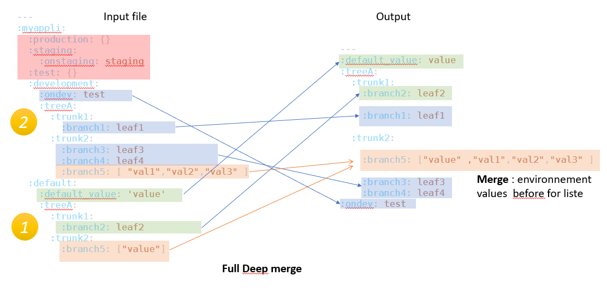
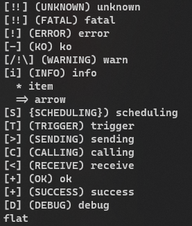
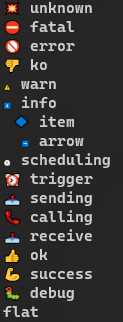
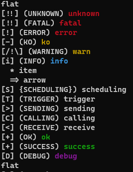
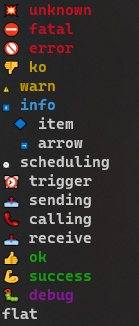

# Carioca

Carioca : Container And Registry with Inversion Of Control for your Applications

Carioca 2: is a complete rewrite who provide a full IoC/DI light Container and a services registry, build with logs, config and Internationalization facilities for designing your applications


[](https://rubydoc.info/gems/carioca)


[](https://badge.fury.io/rb/carioca)


<noscript><a href="https://liberapay.com/ruydiaz/donate"></a></noscript>


 
_Container And Registry with Inversion Of Control for your Applications_


## Installation

Install it yourself as:

    $ gem install carioca

## Principe 


## Usage


### Basic usage


#### Principe


* Carioca come with a Container Class Template
  * the Container automatically inject :logger, :i18n and a :configuration service (explain in detail after) 
  * the Container provide a class method macro :inject 
    *  this macro give a way to use other services defined in the registry file (service could be register inline, presented after)  

### Beginning usecase new gem

Create you own gem :

    $ bundle gem yourgem
    $ cd yourgem
    $ vi yourgem.gemspec

check all the TODO in your gemspec, specify concretly you Gem specification, add the following line :

```ruby
     spec.add_dependency "carioca", "~> 2.0"
```
and after :

    $ bundle add carioca
    $ mkdir -p config/locales

Edit the Rakefile, and add the following line :

```ruby
require "carioca/rake/manage"
```
Verify, all is right with :

    $ rake -T
    rake build                         # Build sample-0.1.0.gem into the pkg directory
    rake carioca:gem:init_path         # prepare Gem vitals path for Carioca
    rake carioca:registry:add_service  # Adding service to Carioca Registry file
    rake carioca:services:config:init  # Initialise Service configuration file ./config/settings.yml file
    rake clean                         # Remove any temporary products
    rake clobber                       # Remove any generated files
    rake install                       # Build and install sample-0.1.0.gem into system gems
    rake install:local                 # Build and install sample-0.1.0.gem into system gems without network access
    rake release[remote]               # Create tag v0.1.0 and build and push sample-0.1.0.gem to Set to 'http://mygemserver.com'
    rake spec                          # Run RSpec code examples

You could now initialize the Carioca registry following the wizard, with (sample with a simple UUID generator gem): 

    $ rake carioca:gem:init_path 
    Carioca : Initialising vitals gem path : done
    $ rake carioca:registry:add_service
    Carioca : registering service :
    Registry File path ? ./config/carioca.registry
    Service name ? uuid
    Choose the service type ? gem
    Description ? The uuid service
    Service [uuid] inline Proc Ruby code ? UUID
    Give the Rubygem name ?  uuid
    Did this service have dependencies ?  no

     => Service : uuid
    Definition
     * type: gem
     * description: The uuid service
     * service: UUID
     * resource: uuid
    Is it correct ?  Yes
    Carioca : Registry saving : done

This will initiate a Carioca Registry (YAML file, the format will be describe after, the wizard support all type of services, managed by Carioca, all keys are Symbols):

    $ cat config/carioca.registry
    ---
    :uuid:
      :type: :gem
      :description: The uuid service
      :service: UUID
      :resource: uuid

Now your are ready to use Carioca :

In this sample, we are going th create a demo command. 
Firstly, we have to configure a basic usage of Carioca, this could be made in the lib path, in the root gem library. 

    $ emacs lib/yourgem.rb 

content of the destination file 

```ruby

# frozen_string_literal: true

require_relative "yourgem/version"
require 'carioca'


Carioca::Registry.configure do |spec|
  spec.debug = true
end

module Yourgem
  class Error < StandardError; end

  class YourgemCMD < Carioca::Container
    def test
      logger.info(self.to_s) { "Log me as an instance method" }
      logger.warn(self.class.to_s) {"Give me an UUID : "  + uuid.generate}
    end

    inject service: :uuid

    logger.info(self.to_s) { "Log me as class method" }

  end

end

```

    $ emacs exe/yourgem_cmd

content of the file

```ruby
require 'yourgem'

yourgem_cmd = Yourgem::YourgemCMD::new
yourgem_cmd.test
```

**Note** : After this, don't forget to stage new files, and you could build & install the gem before running your new command for the first time :

    $ git add config/ exe/
    $ rake install && yourgem_cmd
    yourgem 0.1.0 built to pkg/yourgem-0.1.0.gem.
    yourgem (0.1.0) installed.
    D, [2022-03-07T01:06:20.337961 #21513] DEBUG -- Carioca: Preloaded service :i18n on locale : en
    D, [2022-03-07T01:06:20.338020 #21513] DEBUG -- Carioca: Preloaded service :logger ready on STDOUT
    D, [2022-03-07T01:06:20.338037 #21513] DEBUG -- Carioca: Initializing Carioca registry
    D, [2022-03-07T01:06:20.338049 #21513] DEBUG -- Carioca: Preparing builtins services
    D, [2022-03-07T01:06:20.338079 #21513] DEBUG -- Carioca: Adding service configuration
    D, [2022-03-07T01:06:20.338107 #21513] DEBUG -- Carioca: Adding service i18n
    D, [2022-03-07T01:06:20.338133 #21513] DEBUG -- Carioca: Adding service output
    D, [2022-03-07T01:06:20.338156 #21513] DEBUG -- Carioca: Adding service debugger
    D, [2022-03-07T01:06:20.338191 #21513] DEBUG -- Carioca: Initializing registry from file : ./config/carioca.registry
    D, [2022-03-07T01:06:20.338312 #21513] DEBUG -- Carioca: Adding service uuid
    D, [2022-03-07T01:06:20.338333 #21513] DEBUG -- Carioca: Registry initialized successfully
    I, [2022-03-07T01:06:20.338340 #21513]  INFO -- Sample::YourGemCMD: Log me as class method
    I, [2022-03-07T01:06:20.338351 #21513]  INFO -- #<Sample::YourGemCMD:0x0000000148270698>: Log me as an instance method
    D, [2022-03-07T01:06:20.338381 #21513] DEBUG -- Carioca: Starting service uuid
    W, [2022-03-07T01:06:20.353142 #21513]  WARN -- Sample::YourGemCMD: Give me an UUID : 574cc860-7fd8-013a-2323-1e00870a7189

  

## Builtins services

### Description Registry 


### Description of services


### Generic Usage 

#### Usage with the Carioca::Container template class

Considering an existing service named : my_service with a unique method named a_method

```ruby

# frozen_string_literal: true

require 'carioca'

class MyObject < Carioca::Container

    inject service: my_service

    def initialize
      my_service.a_method
    end

   

    my_service.a_method

  end

end

```
The macro inject is already mixed in Carioca::Container

**Note** : Service cloud be used on class method wrapping and instance mecthode. 

#### Usage without Carioca::Container heritage

Considering an existing service named : my_service with a unique method named a_method

```ruby

require 'carioca'

class MyObject 

    extend Carioca::Injector
    inject service: my_service

    def initialize
      my_service.a_method
    end

    my_service.a_method

  end

end

```

### Service I18n

the I18n is loaded by default with Carioca::Container, and loaded as dependency when using others builtin services.
It's a fondation service for Carioca.

For this exemple, we show you an explicit inject of I18n

**Note** : I18n povide internationalisation for Carioca itself AND for self made services and more  

**Note** : You could create all your locales files for any languages speciif to your application :
- in $PWD/config/locales/*.yml
- in $GEMPATH/config/locales/*.yml

**Note** : If you create locales in other languages than :en or :fr (atcually the 2 supported by Carioca), for internals output (Carioca itself logs, outputs or debugs), carioca fallback on default locales defined in configuration (default :en).


Considering a locale file en.yml in config/locales/ like :

```yaml

en:
  sample:
    string: "Display %{myvar}"
 

```

with the current code :

```ruby

require 'carioca'

class MyObject 

    extend Carioca::Injector
    inject service: I18n

    def initialize
      puts i18n.t('sample.string', myvar: 'test')
    end

  end

end

``` 

output  :

   Display test

### Service Logger 

**Note** : Logger depends on service I18n
#### Logging simply 

```ruby

require 'carioca'

class MyObject 

    extend Carioca::Injector
    inject service: logger

    def initialize
      logger.info(self.to_s) { "my log" }
    end

  end

end

```


#### Changing log strategy 


```ruby
require 'rubygems'
require 'carioca'

Carioca::Registry.configure do |spec|
  spec.debug = false
  spec.log_file = '/tmp/test_carioca.log' # a different log path (default STDOUT)
  spec.log_level = :debug # log level base  (default :info)
  spec.log_target = '::Logger::new(STDOUT)' # to change completly the log object 
end
```


for more information on ruby Stdlib Logger, see :
https://ruby-doc.org/3.2.2/stdlibs/logger/Logger.html


**Note** : you could totally subsitute Logger with your own logger, by the configuration, or the logger of an other service. 
BUT it's necessary to be compatible with standard Logger facilities :

```ruby
logger.debug('Maximal debugging info')
logger.info('Non-error information')
logger.warn('Non-error warning')
logger.error('Non-fatal error')
logger.fatal('Fatal error')
logger.unknown('Most severe')
```

**Note** : the output service, detailled after could work in dual mode STDXXX + logger service. 

### Service Configuration  


#### Configuration 

Configuration made with  Registry.configure :

```ruby
Carioca::Registry.configure do |spec|
  spec.config_file = './config/settings.yml'
  spec.config_root = :myappli
  spec.environment = :development
end
```

* config_file : path to the configuraion file (YAML format) 
* config_root : Root of the YAML structure
* environment : current evt used for override default values

#### Configuration file format

**Note** :This file is corresponding with the presented configuration 

```yaml
---
:myappli:
  :production: {}
  :staging:
    :onstaging: staging
  :test: {}
  :development:
    :ondev: test
    :treeA:
      :trunk1:
        :branch1: leaf1
      :trunk2:
        :branch3: leaf3
        :branch4: leaf4
        :branch5: [ "val1","val2","val3" ] 
  :default:
    :default_value: 'value'
    :treeA:
      :trunk1:
        :branch2: leaf2
      :trunk2:
        :branch5: ["value"]
```

#### Access to Configuration 

```ruby
config = Carioca::Registry.get.get_service name: :configuration
pp config.settings
```

**Note** : You could access it as usuallly, with inject, from Carioca::Container fork or mixin of Carioca::Injector in your own class.

output :

```
{:default_value=>"value",
 :treeA=>
  {:trunk1=>{:branch2=>"leaf2", :branch1=>"leaf1"},
   :trunk2=>
    {:branch5=>["value", "val1", "val2", "val3"],
     :branch3=>"leaf3",
     :branch4=>"leaf4"}},
 :ondev=>"test"}
 ```

**Note** : you could see the result configuration is a merge of :development path ovec :default


#### R/W on runtime

**Note** : you could override value in runtime

```ruby
config = Carioca::Registry.get.get_service name: :configuration
config.settings.newkey = 'value'
```


#### Princpe 




### Service Output 


#### Configuration 

Configuration made with Registry.configure :

```ruby
Carioca::Registry.configure do |spec|
  spec.debug = false
  spec.log_file = '/tmp/test.rge'
  spec.log_level = :debug
  spec.output_mode = :dual
  spec.output_emoji = true
  spec.output_colors = true
  spec.output_target = STDOUT

end
```

* output_mode : choose if you want to display to output_target OR/AND Logs, mode are : :mono, dual, log
* output_emoji : display levels or alias as UTF8 EMOJI
* output_colors : display output in colors
* output_target : change output STDOUT or SDTERR

**Note** : all of this have R/W accessors on output service 

#### Usage 


This example show a test script for displaying all type of output 

```ruby
output = Carioca::Registry.get.get_service name: :output

cycle = %i[unknown fatal error ko warn info item arrow scheduling trigger sending calling receive
               ok success debug flat]
    cycle.each do |verb|
      output.send verb, verb.to_s
    end
    output.color = false
    cycle.each do |verb|
      output.send verb, verb.to_s
    end
    output.emoji = false
    cycle.each do |verb|
      output.send verb, verb.to_s
    end
    output.color = true
    cycle.each do |verb|
      output.send verb, verb.to_s
    end

```
**Note** : list of ordered levels or alias : **unknown fatal error ko warn info item arrow scheduling trigger sending calling receive ok success debug flat**

Output : 

* Without colors nor Emojies



* Without colors but with Emojies



* With colors but no Emojies



* With colors and Emojies



### Service Debug


For this example, we use a internal service defined programmaticalu on runtime, (we see it more in detail in the chapter dedicated to the registry)
At the beginning of you code, just add : 

```ruby
class MyService
  extend Carioca::Injector
  inject service: :logger

  def initialize
    logger.warn(self.class.to_s) { 'Init service' }
  end

  def hello
    logger.info(self.class.to_s) { 'Hello World' }
  end

  def method_test(_titi, tutu:)
    @tutu = tutu
    yield if block_given?
    "result #{@tutu}"
  end
end

spec = {
  service: 'MyService::new',
  type: :internal
}

Carioca::Registry.init.add service: :myservice, definition: spec

```

With a configuration like :


```ruby
Carioca::Registry.configure do |spec|
  spec.debug = true
  spec.log_level = :debug
  spec.output_emoji = true
  spec.output_colors = false
  spec.debugger_tracer = :output
end

```


To help debug with services, Carioca come with a proxy class debugger :

```ruby
config = Carioca::Registry.get.get_service name: :debugger
proxy = debugger.get service: :myservice
    proxy.method_test 'param', tutu: 'keyword' do
      puts 'titi'
    end
```

output : 

```
🐛 BEGIN CALL for service #<MyService:0x00005635ed283290>
🐛 Method called: method_test
🐛 args : param
🐛 keywords : {:tutu=>"keyword"}
🐛 block given
titi
🐛 => method returned: result keyword
🐛 END CALL
```

### Service Finisher

### Service Setup

### Service SanityCheck

### Service Toolbox

The toolbox service is a misceleanous all purpose toolbox of methods, used by carioca's services and available for you.
### Listing of all methods and description 


```ruby
toolbox = Carioca::Registry.get.get_service name: :toolbox
pp toolbox.describe
```

Output (actual for this version, lust increase with the time): 

```ruby
{:is_root?=>"Verify if active current processus is running as root",
 :check_unicode_term=>"Check if terminal support unicode",
 :user_root=>"Get the local system root username ",
 :search_file_in_gem=>"Retrieve absolute path of a file in a specific gem",
 :group_root=>"Get the local system root groupname ",
 :get_processes=>"Get the list of running processus"}
```

### methods usage

```ruby
pp toolbox.user_root
pp toolbox.search_file_in_gem('carioca','config/locales/en.yml')

```

```ruby
"root"
"/var/lib/gems/3.0.0/gems/carioca-2.0.12/config/locales/en.yml"
```

### Service SecureStore


#### Exemple of usage of the Secure Store

This simplist example show how to store current time in Secure Data Store  

**Note** : if the Data store not exist nor the master.key, when injecting the service, the two item are created on initialisation 

```ruby
securestore = Carioca::Registry.get.get_service name: :securestore
res = (securestore.data.empty?)? "first time" : securestore.data.to_s
puts res
securestore.data[:time] = Time.now
securestore.save!
```

Output, on the first iteration :

```
first time
```

Output, on the second iteration :

```
{:time=>2023-06-02 14:27:39.8903567 +0200}
```

**Note** : by default Secure store : secure.store and Master key : master.key (chmod 400, owned by the running user), are created in "~/.carioca" of the running user. 

#### Configuration in Carioca

You could change path for master.key and secure.store with : 

```ruby
Carioca::Registry.configure do |spec|
  spec.user_config_path = "~/.carioca" # default user path (folder)
  spec.master_key_file =  "#{spec.user_config_path}/master.key" # default OpenSSL secret key for service SecureStore
  sepc.secure_store_file = "#{spec.user_config_path}/secure.Store" # default OpenSSL YAM secure store file for service SecureStore
end
```


## Carioca Configuration

Carioca use a bloc given mapping object of to configure like :

```ruby
Carioca::Registry.configure do |spec|
  spec.xxxxx = <SOMETHING>
 ...
end

```
### list of accessors over the spec object :

```ruby
attr_accessor :filename, :name, :builtins, :log_target, :default_locale, :locales_load_path, :debugger_tracer,
                  :config_file, :config_root, :environment, :supported_environments, :output_mode, :log_level, :output_target, :user_config_path,
                  :master_key_file, :secure_store_file
attr_writer :init_from_file, :output_colors, :output_emoji
attr_reader :log_file, :locales_availables, :debug

```

### Publique usage (with default values and possibles values)

```ruby
Carioca::Registry.configure do |spec|

  spec.filename = './config/carioca.registry' # the carioca registry of services configuration
  spec.name = 'Carioca' # the name of the application
  spec.debug = false # activate debug, display debug Carioca message
  spec.init_from_file = true # use the registry file to init services : (spec.filename)
  spec.log_file = '' # path to a log file for carioca logger service
  spec.config_file = './config/settings.yml' # path to the YAMl COnfiguration file for :configuration Carioca service 
  spec.config_root = :carioca # the config root in the YAMl COnfiguration file for :configuration Carioca service
  spec.environment = :development # the current environment running with Carioca
  spec.default_locale = :en # the default locales Carioca fot I18n Carioca Service
  spec.log_level = :info # the current log level (see logger ) for Carioca in :debug,:info,:warn,:error,:fatal,:unknown
  spec.output_mode = :mono # the current output mode in :mono, :dual, :log (see Carioca Service Output)
  spec.output_emoji = true # the current output status for emoji (see Carioca Service Output)
  spec.output_target = STDOUT # the current output target STDOUT or STDERR (see Carioca Service Output)
  spec.output_colors = true # the current output status for colors (see Carioca Service Output)
  spec.locales_load_path << Dir["#{File.expand_path('./config/locales')}/*.yml"]
  spec.debugger_tracer = :output # the Debbugger service output in #log , :output
  spec.user_config_path = "~/.carioca" # default user path (folder)
  spec.master_key_file =  "#{spec.user_config_path}/master.key" # default OpenSSL secret key for service SecureStore
  sepc.secure_store_file = "#{spec.user_config_path}/secure.Store" # default OpenSSL YAM secure store file for service SecureStore

end
```
## Registry access and methods

### Init or getting Registry 

Carioca::Registry is a Singleton Object

You cloud init or get it by #get, #instance or #init, like :

```ruby
registry = Carioca::Registry.init
registry = Carioca::Registry.instance
registry = Carioca::Registry.get 
```

### Direct access to Registry and getting service Without Injector or Carioca::Container

Example : for output service

```ruby
output = Carioca::Registry.get.get_service name: :output 
```


### Adding a service programatically 

To add a service, you could insert it in the registry file (before run) or adding it programatically

```ruby
class MyService
  extend Carioca::Injector
  inject service: :logger

  def initialize
    logger.warn(self.class.to_s) { 'Init service' }
  end

  def hello
    logger.info(self.class.to_s) { 'Hello World' }
  end

  def method_test(_titi, tutu:)
    @tutu = tutu
    yield if block_given?
    "result #{@tutu}"
  end
end

spec = {
  service: 'MyService::new',
  type: :internal
}

Carioca::Registry.init.add service: :myservice, definition: spec

```


### Decription of type of Service 


```ruby
SERVICES_MANDATORY_SPECS = { type: Symbol, service: String }.freeze
SERVICES_FULL_LIST_SPECS = SERVICES_MANDATORY_SPECS.merge({ depends: Array, description: String,
                                                                resource: String })
```


* :type must be : :gem, :file, :stdlib all engage requirement of the resource field, tje last :internal is usable if the code is internal in your application.

* :service : is the Ruby code to access to Class for class methods service usage or object instance
  example : MYCLASS or MyClass::new(params)

* :resource is respectively a name of a gem, an absolut path of a ruby file, the name of a Ruby Stdlib correspondingly to :type 
* depends : is a list of requiered services for this service. (all services in depends are load before getting the wanted service (from builtin and in registry file or added at runtime ).
* Description is not mandatory 


## Development

After checking out the repo, run `bin/setup` to install dependencies. Then, run `rake spec` to run the tests. You can also run `bin/console` for an interactive prompt that will allow you to experiment.

To install this gem onto your local machine, run `bundle exec rake install`. To release a new version, update the version number in `version.rb`, and then run `bundle exec rake release`, which will create a git tag for the version, push git commits and the created tag, and push the `.gem` file to [rubygems.org](https://rubygems.org).

## Contributing

Bug reports and pull requests are welcome on GitHub at https://github.com/Ultragreen/carioca.
